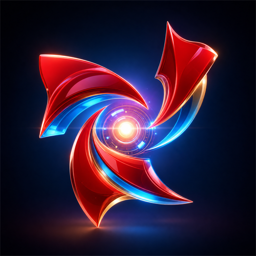

<p align="center">
  
</p>

<h1 align="center">YuTianClaw</h1>

<p align="center">
  <strong>One-click OpenClaw deployment for AI digital employees</strong><br/>
  <sub>A desktop workspace for agents, chat channels, skills, local files, and automated tasks.</sub>
</p>

<p align="center">
  
  
  
  
  
</p>

<p align="center">
  Project: <a href="https://github.com/dghutr/yutianClaw">https://github.com/dghutr/yutianClaw</a>
</p>

---

## Overview

YuTianClaw is a desktop platform built around OpenClaw for creating and running AI
digital employees. It packages the runtime, model configuration, chat channels,
skills, local file handling, PDF generation, image generation, scheduled tasks,
and operational tooling into one visual application.

The goal is to move AI from simple chat into executable workflows. A user can
talk to an agent, ask it to analyze information, generate local files, call
skills, connect to external chat channels, and return results to the right
conversation.

## Core Features

- **Bundled runtime**: ships with the required Node.js and OpenClaw runtime.
- **Visual model setup**: connect built-in providers or custom OpenAI-compatible endpoints.
- **Digital employee management**: create multiple agents with separate roles, workspaces, tools, and skills.
- **Live chat**: multi-session desktop chat with streaming output, reasoning/process display, usage display, and file actions.
- **External channels**: connect IM channels such as Feishu and WeCom, bind accounts to agents, and sync conversations back to the desktop.
- **Skills marketplace**: browse, import, vet, install, enable, disable, and export skills.
- **Built-in skills**: PDF generation, image generation, video-related workflows, and local file utilities.
- **MCP support**: manage MCP services while protecting runtime configuration from unsafe writes.
- **Automation**: create scheduled jobs for recurring intelligence collection and other workflows.
- **Account integration**: login, sync API keys, show balance, and route calls through the configured model provider.
- **Operations tooling**: logs, backups, crash recovery, updates, proxy settings, and gateway diagnostics.

## Typical Use Cases

- Generate course introductions, reports, PDF files, and marketing material.
- Build teaching assistants, homework assistants, exam assistants, and career planning assistants.
- Use mobile chat channels to control desktop agents that can operate local files.
- Connect custom large language models and compare provider performance.
- Run scheduled research, monitoring, and content preparation tasks.
- Extend the platform with paid or private skills.

## Getting Started

### Install

Download the installer from the project release page when a packaged build is
available:

<p>
  <a href="https://github.com/dghutr/yutianClaw/releases">https://github.com/dghutr/yutianClaw/releases</a>
</p>

| Platform | Architectures |
|----------|---------------|
| Windows | x64 / arm64 |
| macOS | Apple Silicon / Intel |

### First Launch

1. Open the desktop app.
2. Log in or manually configure a model provider.
3. Start the gateway when the app prompts you.
4. Create or select a digital employee.
5. Start chatting, connect channels, or install skills as needed.

If no model is configured, the app will prompt the user to log in or manually
add a provider before chat execution.

## Build From Source

### Requirements

- Node.js 22+
- npm 10+

### Development

```bash
git clone https://github.com/dghutr/yutianClaw.git
cd yutianClaw
npm install
npm run dev
```

### Common Commands

| Command | Description |
|---------|-------------|
| `npm run dev` | Start the Electron development app |
| `npm run typecheck` | Run TypeScript checks |
| `npm test` | Run tests once |
| `npm run build` | Build app bundles |
| `npm run dist:win:x64` | Build a Windows x64 installer |
| `npm run dist:mac:arm64` | Build a macOS arm64 package |

## Technology Stack

| Layer | Technology |
|-------|------------|
| Desktop | Electron |
| Build | electron-vite |
| UI | React + Ant Design |
| State | Zustand |
| i18n | i18next |
| Runtime | OpenClaw + bundled Node.js |
| Packaging | electron-builder |
| Testing | Vitest |

## Repository Notes

Generated installers, unpacked builds, runtime targets, caches, local logs, and
test artifacts are intentionally excluded from source control.

## Acknowledgements

- [OpenClaw](https://github.com/OpenClaw) for the agent runtime foundation.
- [Electron](https://www.electronjs.org/) for the cross-platform desktop shell.
- [React](https://react.dev/) and [Ant Design](https://ant.design/) for the UI layer.

## License

YuTianClaw is released under the [GPL-3.0 License](LICENSE).
